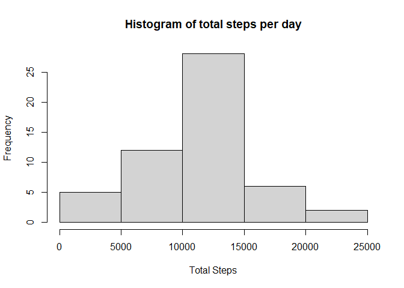
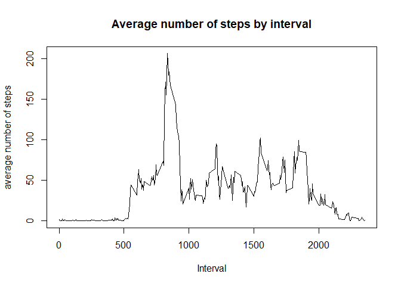
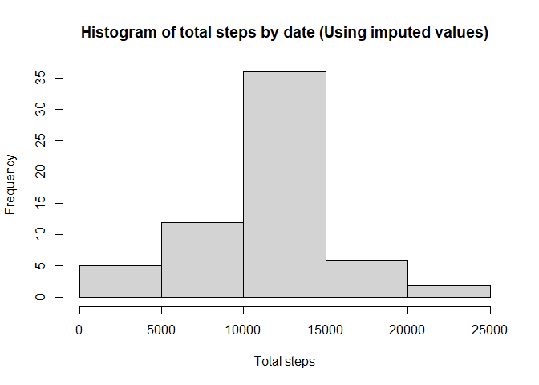
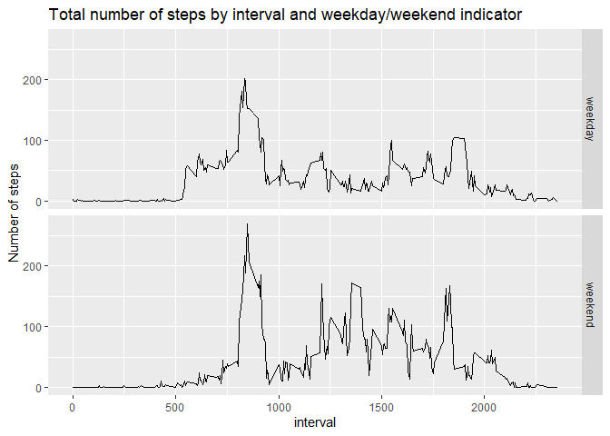

### Loading and preprocessing the data


```r
unzip("activity.zip")
data<-read.csv("activity.csv", header=TRUE)
```

### What is the mean total number of steps taken per day?

One way to calculate the mean given a dataset with NA values is to remove the NA values. That's done here.


```r
data_no_na<-data[!is.na(data$steps), ]
```

Next, we'll calcuate the number of days, the total number of steps and the quotient of the two in order to calculate the 
total number of steps per day.


```r
number_of_days<-length(unique(data_no_na$date))
total_number_of_steps<-sum(data_no_na$steps)
steps_per_day<-total_number_of_steps / number_of_days
steps_per_day
```

```
## [1] 10766.19
```

In order to create a histogram for total steps taken each day, we'll summarize the data using the group_by() and summarize() functions. Then plot the results.


```r
grouped_data<-group_by(data_no_na, date) %>% summarize(total_steps=sum(steps)) 
hist(grouped_data$total_steps, xlab="Total Steps", main="Histogram of total steps per day") 
```

<!-- -->

Calculate the mean and median of the total number of steps taken per day.


```r
mean(grouped_data$total_steps) 
```

```
## [1] 10766.19
```

```r
median(grouped_data$total_steps)
```

```
## [1] 10765
```

### What is the average daily activity pattern?

Group the data by interval.


```r
grouped_data_by_interval<-group_by(data_no_na, interval) %>% 
                                        summarize(average_steps=mean(steps))
```

Plot the average number of steps for each interval across every recorded day.


```r
plot(x=grouped_data_by_interval$interval, y=grouped_data_by_interval$average_steps, 
        xlab="Interval", ylab="average number of steps", main="Average number of steps by interval", type="l") 
```

<!-- -->

Find the interval that has the highest average number of steps.Interval 835 has the highest average number of steps.


```r
grouped_data_by_interval$interval [which.max(grouped_data_by_interval$average_steps)] 
```

```
## [1] 835
```

### Imputing Missing values

Create a new table that contains only rows where the number of steps is NA. (In this case, all the NAs in the table are in the steps column, so using complete.cases() is acceptable here.) There are 2,304 rows with missing values. 


```r
na_rows<-data[!complete.cases(data),]
nrow(na_rows) #Number of missing values
```

```
## [1] 2304
```

In order to impute missing values, we'll impute based on the missing value's interval; the imputed value will be the average for that interval across all of the days.


```r
data_no_na<-data[!is.na(data$steps), ] #dataset with no NA values
mean_by_interval<-group_by(data_no_na, interval) %>% 
    summarize(average_steps=mean(steps)) #calculate the mean value for each interval
```

Attach the imputed values to the dataset with NA values.


```r
imputed_data<-merge(x=na_rows, y=mean_by_interval, by=intersect(names(na_rows), names(mean_by_interval))) %>%
                  select(average_steps, date, interval) %>%
                      rename(steps=average_steps)
```

Use the rbind() function to put the NA dataset and the dataset without NA values.


```r
data_w_imputed<-rbind(data_no_na, imputed_data)
```

Next, we'll calculate a histogram for the total number of steps taken each day. To do this the data must first be summarized at the date level using the new dataset with imputed values. Then the hist() function is used to generate the histogram.


```r
grouped_data_by_day<-group_by(data_w_imputed, date) %>% summarize(total_steps=sum(steps))
hist(grouped_data_by_day$total_steps, xlab="Total steps", main="Histogram of total steps by date (Using imputed values)") 
```

<!-- -->

The mean and median for each day using imputed values is below. The mean is the same as the datset with no imputation, but the median has increased so that it equals the mean.


```r
mean(grouped_data_by_day$total_steps) #10,766
```

```
## [1] 10766.19
```

```r
median(grouped_data_by_day$total_steps) #10,766
```

```
## [1] 10766.19
```

### Are there differences in activity patterns between weekdays and weekends?

Creating a new variable that indicates whether the day is a weekday or weekend. The first step is to convert the date column from a character format to a date format. We feed this into the wday() format which returns a vector of integer values from 1-7. Mutate() is used to convert into categorical variable of "weekday" and "weekend".


```r
data_no_na$day_of_week<-wday(as.Date(data_no_na$date))
data_no_na<-mutate(data_no_na, day_type_ind=ifelse(day_of_week %in% c(1,2,3,4,5), "weekday", "weekend"))
```


```r
grouped_data<-group_by(data_no_na, day_type_ind, interval) %>% summarize(interval_avg=mean(steps))
```

```
## `summarise()` has grouped output by 'day_type_ind'. You can override using the
## `.groups` argument.
```

```r
ggplot(grouped_data, aes(x=interval, y=interval_avg)) +
    ggtitle("Total number of steps by interval and weekday/weekend indicator") +
    ylab("Number of steps")+
    geom_line()+
    facet_grid(rows=vars(day_type_ind))
```

<!-- -->
